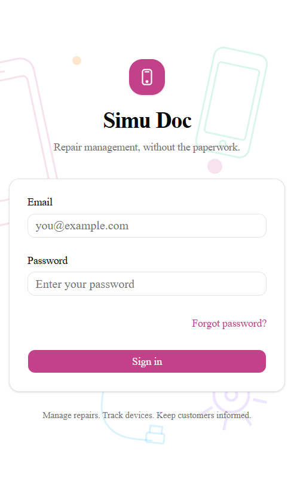
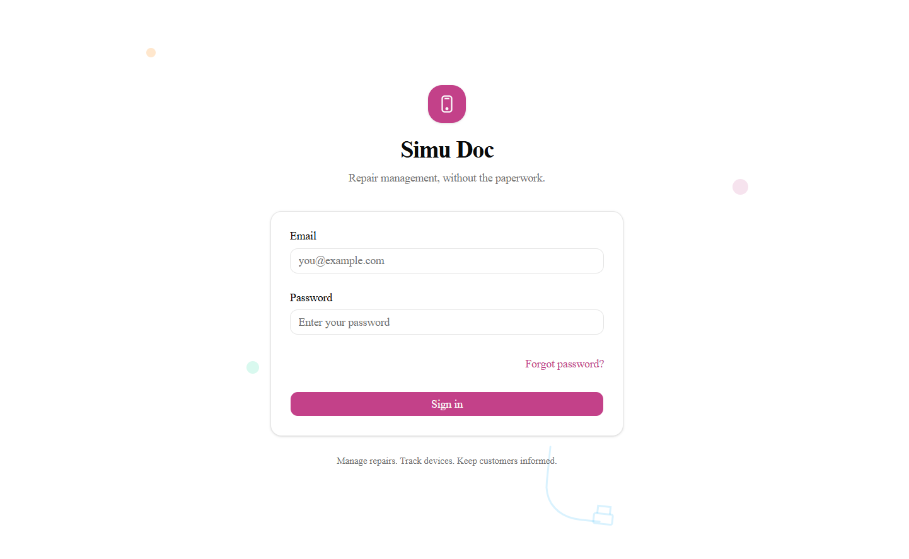
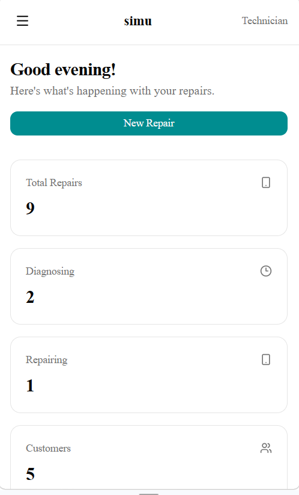
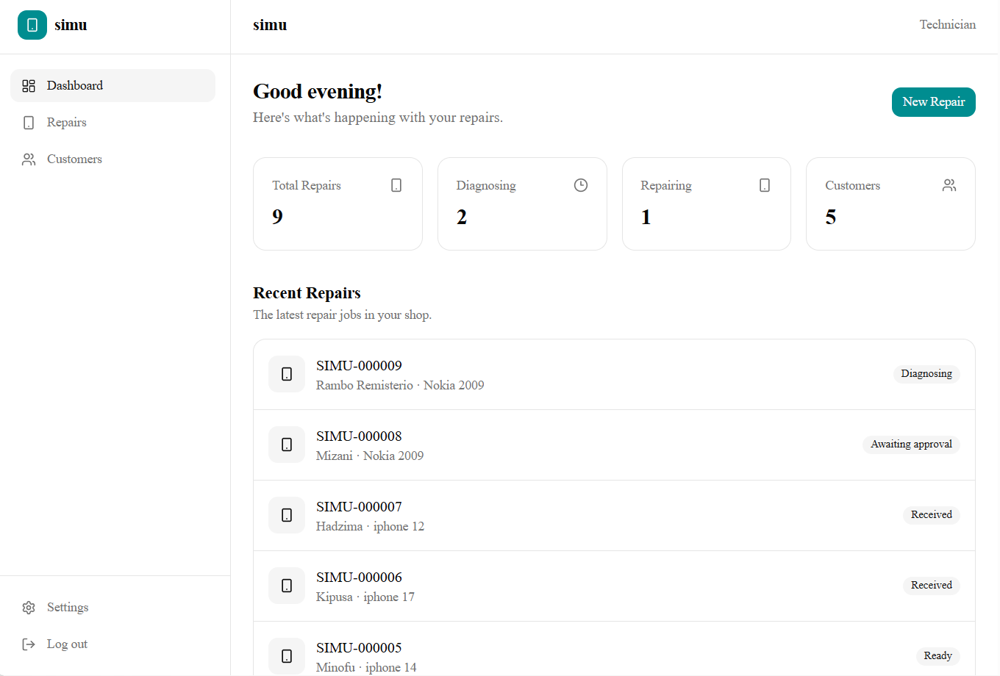
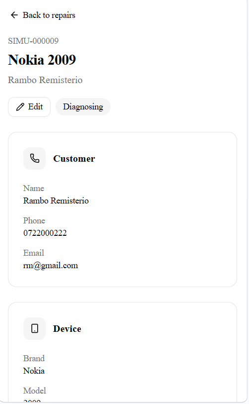
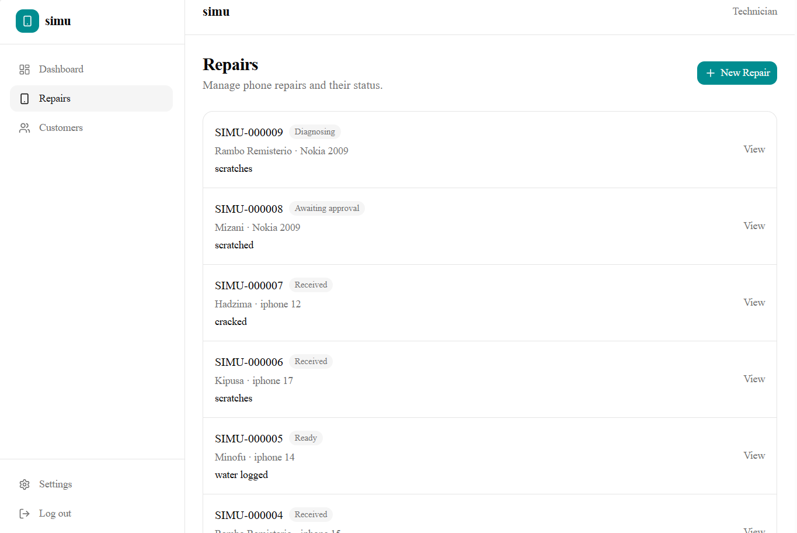
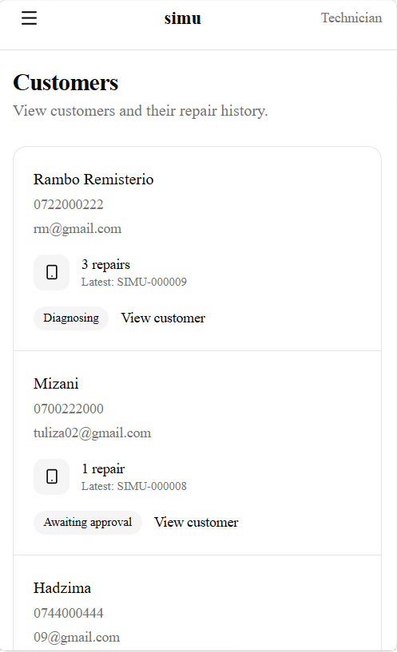
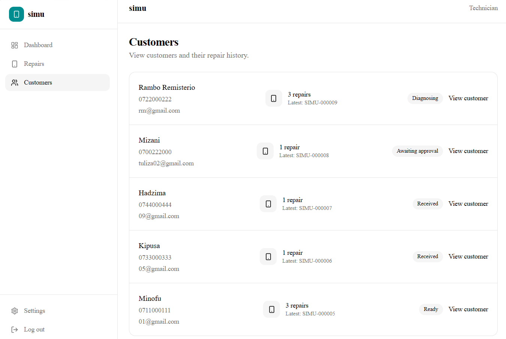

# Simu Doc

A repair management platform designed for phone repair businesses.

## Live Demo

https://simudoc.vercel.app/

## Features

- Repair management
- Customer management
- Repair status tracking
- Authentication
- Password recovery
- Role-based access control
- Customer-facing repair tracking
- Responsive dashboard
- Supabase-backed data storage

## Tech Stack

- Next.js
- TypeScript
- Tailwind CSS
- Supabase
- Vercel

## Screenshots

### Login / Authentication

<table> <tr> <td></td> 
  <td></td> </tr> </table>

### Dashboard

<table> <tr> <td></td> 
  <td></td> </tr> </table>

### Repairs

<table> <tr> <td></td> 
  <td></td> </tr> </table>

### Customers

<table> <tr> <td></td> 
  <td></td> </tr> </table>

## Security

The production application uses authenticated access and database-level
Row Level Security (RLS) policies.

Source code is intentionally kept private.

## Deployment

The application is deployed using Vercel with Supabase providing
authentication and database services.

## Project

Simu Doc is a custom repair-management application built for
demonstration and production use.

## Project Status

Live and actively maintained.

## License

This repository contains project documentation and screenshots only.
The application source code is private.
